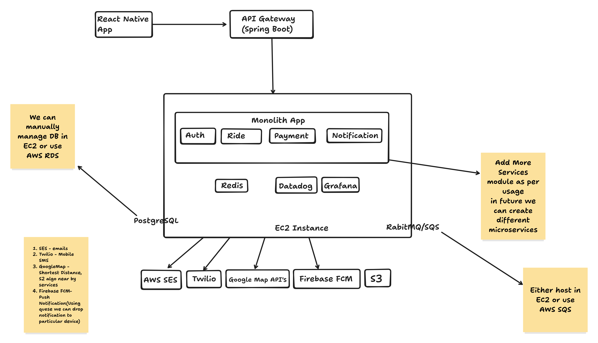

# 🏗️ System Architecture

## Overview

RiderX is a scalable, modular, service-oriented architecture that supports multiple ride types (car, bike, carpool) and real-time operations across mobile and backend infrastructure.

## 🌐 High-Level Architecture


- **Monolith Backend** using Spring Boot
- **PostgreSQL** for relational data and full-text search (`tsvector`)
- **Redis** for caching sessions, OTP throttling
- **React Native App** for cross-platform mobile UI
- **Firebase FCM** for push notifications
- **Twilio** for OTP delivery
- **AWS SES** for transactional emails
- **S3** for media storage
- **AWS EC2** for hosting (Docker-based)
- **RabbitMQ / AWS SQS** for async job queueing
- **OpenTelemetry + Prometheus + Grafana / Datadog** for observability
- **Payment Gateway:** Razorpay / Stripe (TBD)
- **Security:** AWS Security Groups, firewalls, AES encryption for sensitive data

---

## 🧱 Tech Stack

| Layer              | Technology                       |
|-------------------|----------------------------------|
| Backend            | Spring Boot (Java)               |
| Mobile             | React Native (TypeScript)        |
| Database           | PostgreSQL + `tsvector`          |
| Cache              | Redis                            |
| Message Queue      | RabbitMQ / AWS SQS               |
| Notifications      | Firebase FCM                     |
| Email              | AWS SES                          |
| SMS OTP            | Twilio                           |
| Maps               | Google Maps API                  |
| Object Storage     | AWS S3                           |
| Observability      | OpenTelemetry + Prometheus       |
| Monitoring (Opt.)  | Grafana / Datadog                |
| CI/CD              | GitHub Actions + Terraform + GHCR |
| Hosting            | Dockerized app on AWS EC2        |

---

## 💰 Cost Breakdown (Monthly Estimate in INR)

| Service             | Estimated Cost (INR) | Notes                                  |
|---------------------|----------------------|----------------------------------------|
| AWS EC2 (t3.small)   | ₹ 2,000 – ₹ 2,500     | Hosting monolith backend               |
| PostgreSQL (RDS)     | ₹ 3,000 – ₹ 4,000     | Managed DB or self-hosted              |
| Redis (Elasticache)  | ₹ 1,000 – ₹ 1,500     | Or self-hosted                         |
| Twilio (OTP)         | ₹ 0.40 per SMS        | Prepaid / postpaid                     |
| Firebase FCM         | Free Tier             |                                         |
| AWS SES              | ₹ 0.10 per 1,000 mails| First 62K/month free                   |
| Google Maps API      | ₹ 200–1,000           | Based on usage                         |
| S3 Storage           | ₹ 1–3/GB              | Based on storage volume                |
| Datadog (Optional)   | ₹ 1,500+              | Free tier available                    |
| GitHub Actions       | Free Tier / ₹₹        | Based on minutes used                  |
| Terraform            | Free CLI              | Using OSS                              |
| Domain Name & SSL    | ₹ 800/year            | Optional: Namecheap, Route53           |

_Total Monthly Budget_: **~ ₹10,000 – ₹15,000** for early-stage ops

> See [spreadsheet](./assets/riderXEstimates.xlsx) for detailed calculations.

---

## 🚀 Deployment Pipeline

```mermaid
graph TD
  A[GitHub Push] --> B[GitHub Actions CI]
  B --> C[Build Docker Image]
  C --> D[Push to GitHub Container Registry]
  D --> E[Terraform Provisioning (EC2, S3, etc.)]
  E --> F[SSH to EC2 & Deploy Docker Compose]
````

---

## 📊 Monitoring & Observability

* **OpenTelemetry** for distributed tracing
* **Prometheus** for metrics collection
* **Grafana** for dashboarding
* Optional: **Datadog** if you want a SaaS solution (easy but costly)

---

## 🔒 Security

* Use **AES-256** to encrypt sensitive data like user credentials and tokens
* Configure **AWS Security Groups** for basic firewall
* Use HTTPS (Let’s Encrypt or ACM)
* Role-based access control in backend
* Input validation & sanitation (backend + frontend)

---

## 📈 Scaling Recommendations (Future)

* Move to **microservices** when:

    * Traffic becomes hard to manage in a monolith
    * Teams work on different domains (e.g., payment, driver, rides)
* Use **EKS/Fargate** if you need container orchestration
* Integrate **CDN** and **WebSockets** for real-time ride updates
* Use **Elasticsearch** for geo queries + text search
* Expand to multi-region with RDS/Aurora Global

---

## 📄 ER Diagram & Data Design

> To be added: 

---

## 🧪 Testing

* Postman or Thunder Client for manual API testing
* JUnit for backend unit testing
* Detox for mobile E2E (React Native)
* GitHub Actions CI can run tests on each PR

---

## 📎 Useful Links

* [Twilio OTP Setup](https://www.twilio.com/docs/verify)
* [AWS SES Setup](https://docs.aws.amazon.com/ses/latest/DeveloperGuide/send-email.html)
* [Firebase FCM Guide](https://firebase.google.com/docs/cloud-messaging)
* [OpenTelemetry for Java](https://opentelemetry.io/docs/instrumentation/java/)

